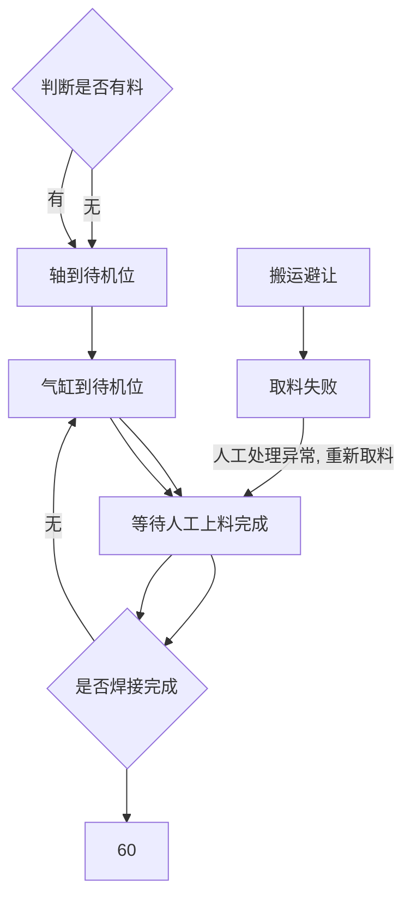

```mermaid
graph TD
10{判断是否有料}-->|无|20
10-->|有|20
20[轴到待机位]-->30
30[气缸到待机位]-->40
40[等待人工上料完成]-->50
50[轴到待机位]-->60
30[气缸到待机位]-->40
40[等待人工上料完成]-->50
50{是否焊接完成}-->|无|30


90[搬运避让]-->900

900[取料失败]-->|人工处理异常, 重新取料|40
```