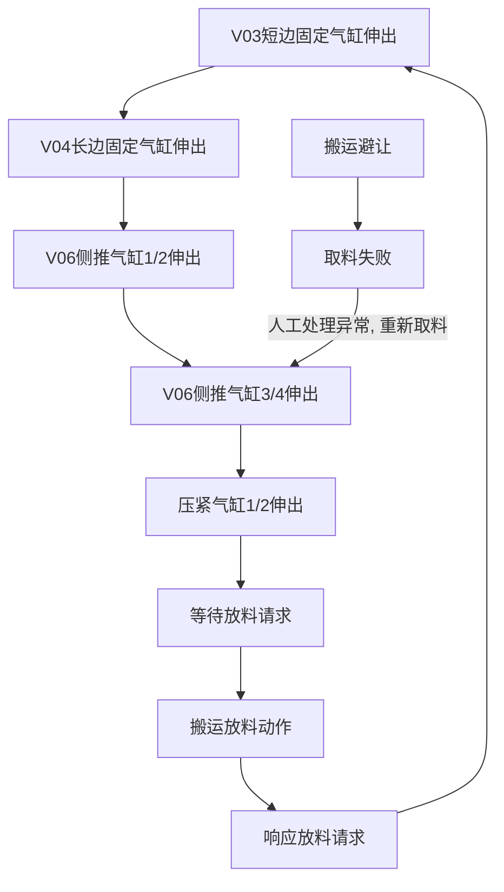

```mermaid
graph TD
10[V03短边固定气缸伸出]-->20
20[V04长边固定气缸伸出]-->30
30[V06侧推气缸1/2伸出]-->40
40[V06侧推气缸3/4伸出]-->50
50[压紧气缸1/2伸出]-->60
60[等待放料请求]-->70
70[搬运放料动作]-->80
80[响应放料请求]-->10

90[搬运避让]-->900

900[取料失败]-->|人工处理异常, 重新取料|40
  
```