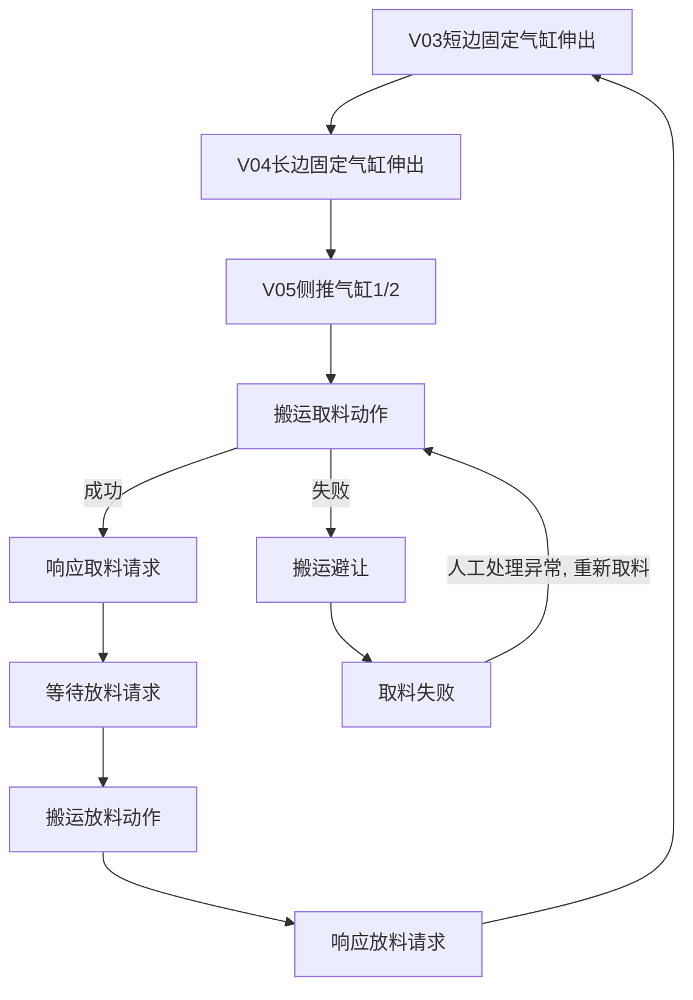

```mermaid
graph TD
10[V03短边固定气缸伸出]-->20
20[V04长边固定气缸伸出]-->30
30[V05侧推气缸1/2]-->40
40[搬运取料动作]-->|成功|50
40-->|失败|90
50[响应取料请求]-->60
60[等待放料请求]-->70
70[搬运放料动作]-->80
80[响应放料请求]-->10

90[搬运避让]-->900

900[取料失败]-->|人工处理异常, 重新取料|40
  
```