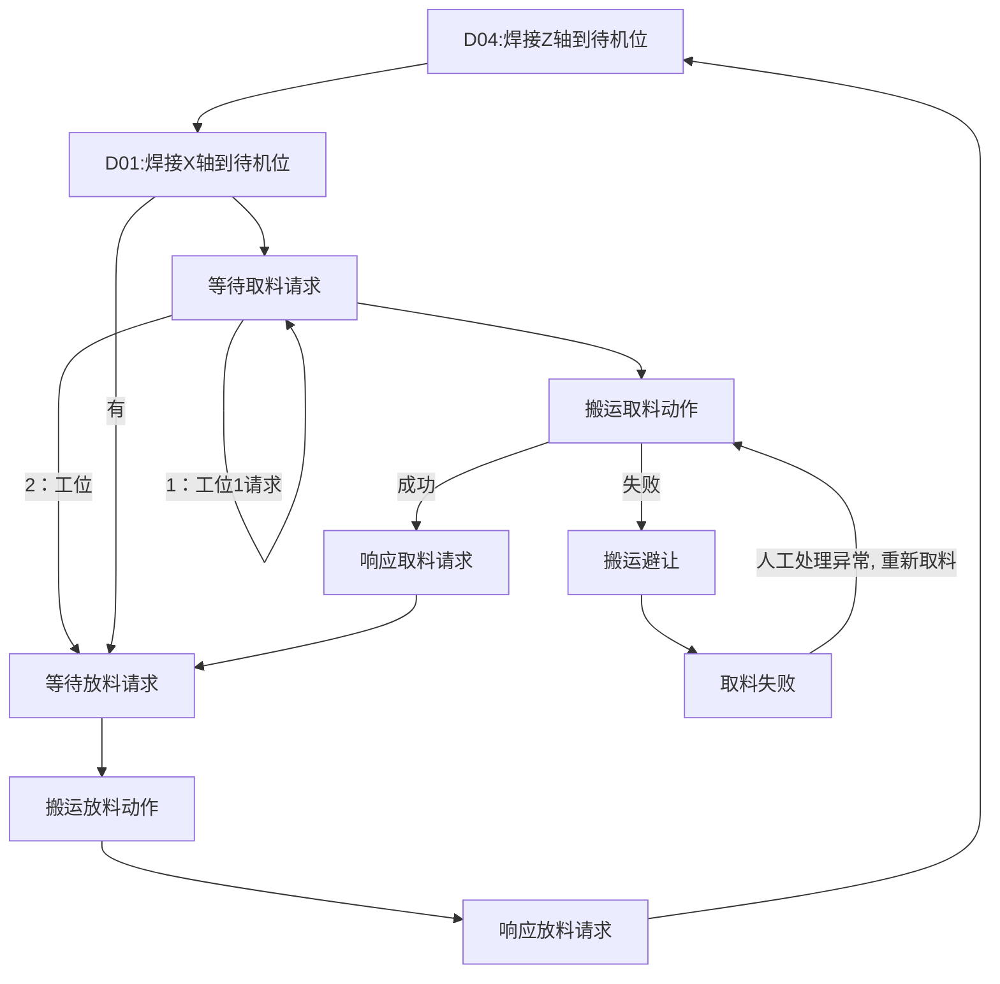

```mermaid
graph TD
10[D04:焊接Z轴到待机位]-->20
20[D01:焊接X轴到待机位]-->30
30{等待请求焊接信号}-->|1：工位1请求|30
30-->|2：工位|60

20-->|有|60
30[等待取料请求]-->40
40[搬运取料动作]-->|成功|50
40-->|失败|90
50[响应取料请求]-->60
60[等待放料请求]-->70
70[搬运放料动作]-->80
80[响应放料请求]-->10

90[搬运避让]-->900

900[取料失败]-->|人工处理异常, 重新取料|40
```