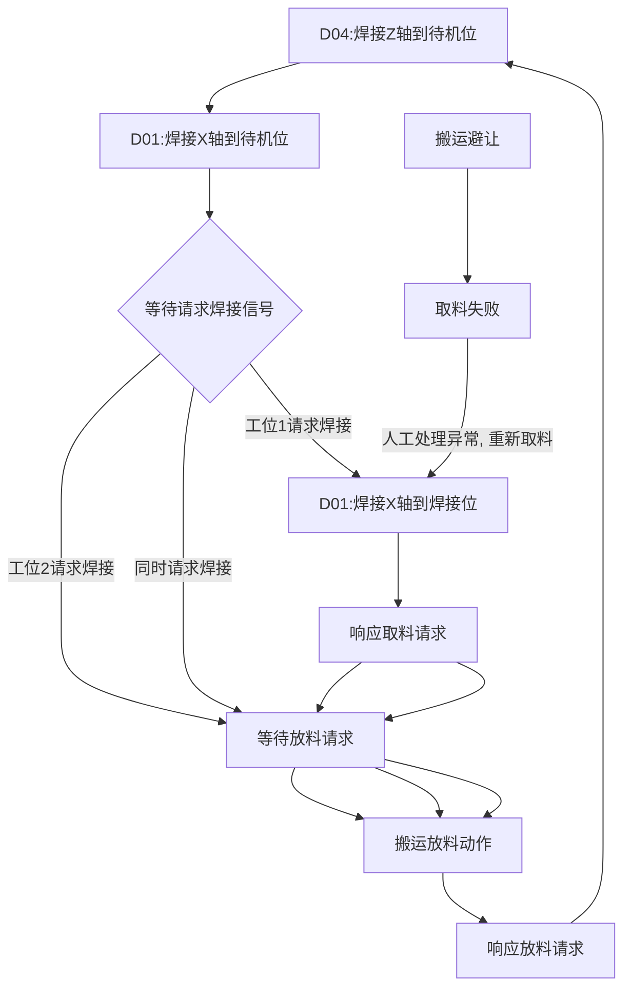

```mermaid
graph TD
10[D04:焊接Z轴到待机位]-->20
20[D01:焊接X轴到待机位]-->30
30{等待请求焊接信号}-->|工位1请求焊接|40
30-->|工位2请求焊接|60
30-->|同时请求焊接|60
40[D01:焊接X轴到焊接位]-->50
50[D04:焊接Z轴到焊接位]-->60
60[启动焊接子流程]-->70
60[启动焊接子流程]-->70
50[响应取料请求]-->60
60[等待放料请求]-->70
70[搬运放料动作]-->80
80[响应放料请求]-->10

90[搬运避让]-->900

900[取料失败]-->|人工处理异常, 重新取料|40
```