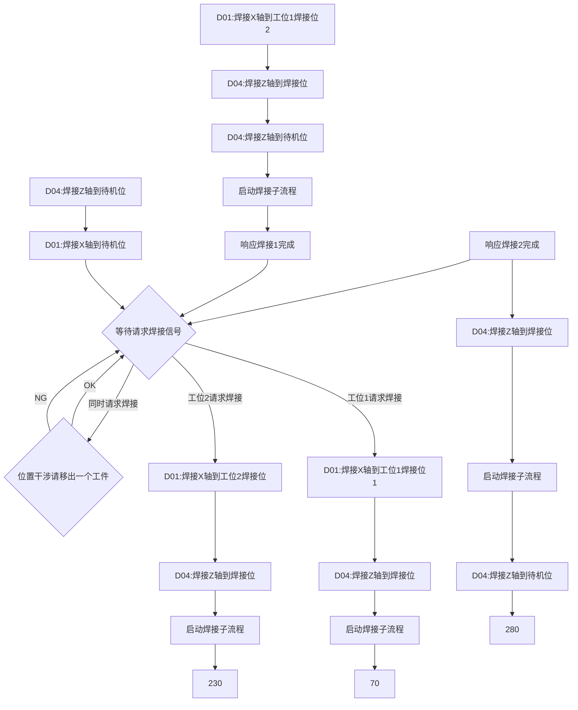

```mermaid
graph TD
10[D04:焊接Z轴到待机位]-->20
20[D01:焊接X轴到待机位]-->30
30{等待请求焊接信号}-->|工位1请求焊接|40
30-->|工位2请求焊接|200
30-->|同时请求焊接|900
40[D01:焊接X轴到工位1焊接位1]-->50
50[D04:焊接Z轴到焊接位]-->60
60[启动焊接子流程]-->70
80[D01:焊接X轴到工位1焊接位2]-->90
90[D04:焊接Z轴到焊接位]-->100
100[D04:焊接Z轴到待机位]-->110
110[启动焊接子流程]-->120
120[响应焊接1完成]-->30
200[D01:焊接X轴到工位2焊接位]-->210
210[D04:焊接Z轴到焊接位]-->220
220[启动焊接子流程]-->230
240[D01:焊接X轴到工位2焊接位]-->250
250[D04:焊接Z轴到焊接位]-->260
260[启动焊接子流程]-->270
270[D04:焊接Z轴到待机位]-->280
240[响应焊接2完成]-->30
900{位置干涉请移出一个工件}-->|OK|30
900-->|NG|30
```