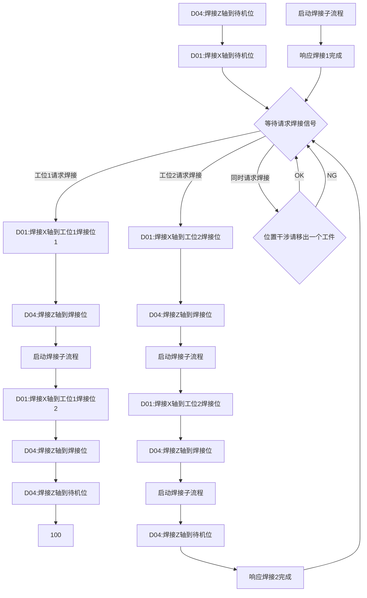

```mermaid
graph TD
10[D04:焊接Z轴到待机位]-->20
20[D01:焊接X轴到待机位]-->30
30{等待请求焊接信号}-->|工位1请求焊接|40
30-->|工位2请求焊接|200
30-->|同时请求焊接|900
40[D01:焊接X轴到工位1焊接位1]-->50
50[D04:焊接Z轴到焊接位]-->60
60[启动焊接子流程]-->70
70[D01:焊接X轴到工位1焊接位2]-->80
80[D04:焊接Z轴到焊接位]-->90
90[D04:焊接Z轴到待机位]-->100
110[启动焊接子流程]-->120
120[响应焊接1完成]-->30
200[D01:焊接X轴到工位2焊接位]-->210
210[D04:焊接Z轴到焊接位]-->220
220[启动焊接子流程]-->230
230[D01:焊接X轴到工位2焊接位]-->240
240[D04:焊接Z轴到焊接位]-->250
250[启动焊接子流程]-->260
260[D04:焊接Z轴到待机位]-->270
270[响应焊接2完成]-->30
900{位置干涉请移出一个工件}-->|OK|30
900-->|NG|30
```