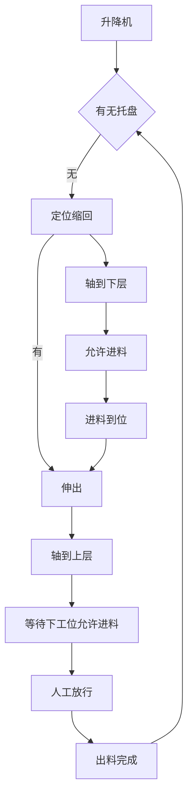

```mermaid
graph TD
0[升降机]-->10
10{有无托盘}-->|无|20
20-->|有|60
20[止回缩回]-->30
20[定位缩回]
30[轴到下层]-->40
40[允许进料]-->50
50[进料到位]-->60
60[止回/伸出]-->70
60[伸出]
70[轴到上层]-->80
80[等待下工位允许进料]-->90
90[人工放行]-->100
100[出料完成]-->10
```