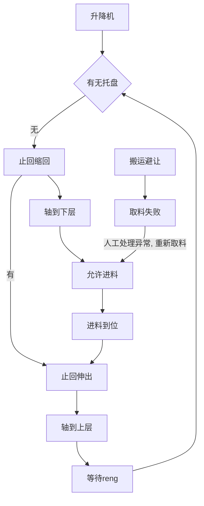

```mermaid
graph TD
0[升降机]-->10
10{有无托盘}-->|无|20
20-->|有|60
20[止回缩回]-->30
30[轴到下层]-->40
40[允许进料]-->50
50[进料到位]-->60
60[止回伸出]-->70
70[轴到上层]-->80
80[等待reng]-->10
90[搬运避让]-->900

900[取料失败]-->|人工处理异常, 重新取料|40
```