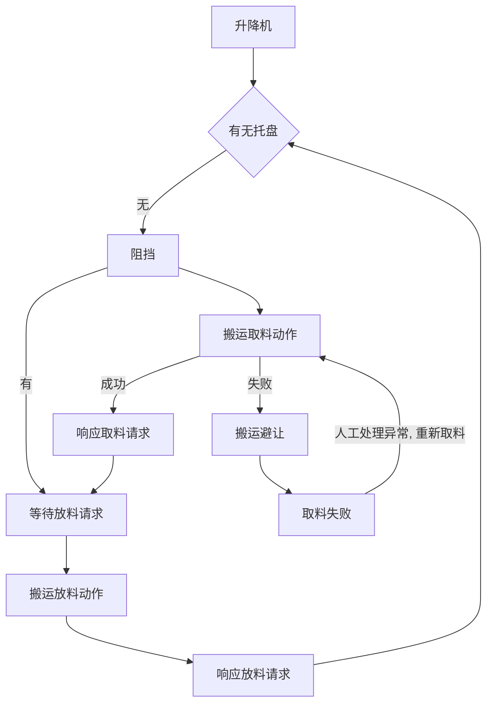

```mermaid
graph TD
0[升降机]-->10
10{有无托盘}-->|无|20
20-->|有|60
20[阻挡]-->40
40[搬运取料动作]-->|成功|50
40-->|失败|90
50[响应取料请求]-->60
60[等待放料请求]-->70
70[搬运放料动作]-->80
80[响应放料请求]-->10
90[搬运避让]-->900

900[取料失败]-->|人工处理异常, 重新取料|40
```