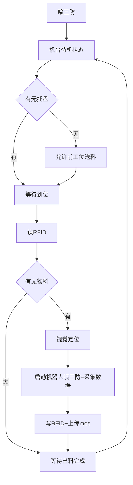

```mermaid
graph TD
0[喷三防]-->10
10[机台待机状态]-->20
20{有无托盘}-->|有|40
20-->|无|30
30[允许前工位送料]-->40
40[等待到位]-->50
50[读RFID]-->60
60{有无物料}-->|无|100
60-->|有|70
70[视觉定位]-->80
80[启动机器人喷三防+采集数据]-->90
90[写RFID+上传mes]-->100
100[等待出料完成]-->10
```