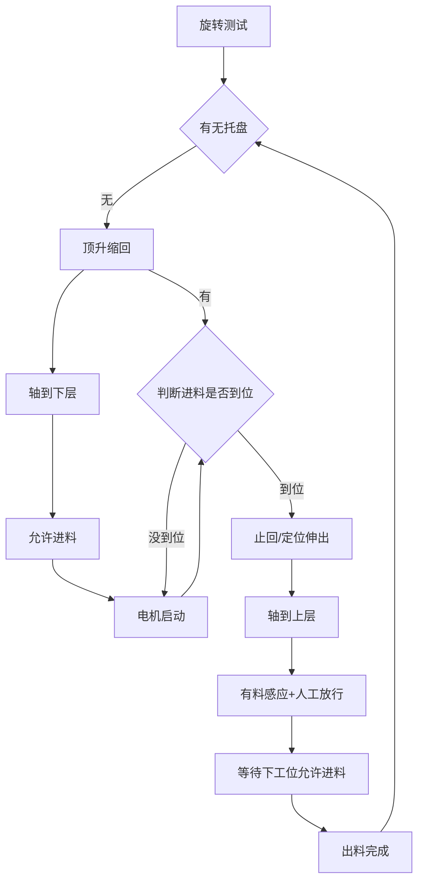

```mermaid
graph TD
0[旋转测试]-->10
10{有无托盘}-->|无|20
20-->|有|50
20[顶升缩回]-->30
30[轴到下层]-->40
40[允许进料]-->45
45[电机启动]-->50
50{判断进料是否到位}-->|到位|60 
50-->|没到位|45
60[止回/定位伸出]-->70
70[轴到上层]-->80
80[有料感应+人工放行]-->90
90[等待下工位允许进料]-->100
100[出料完成]-->10
```