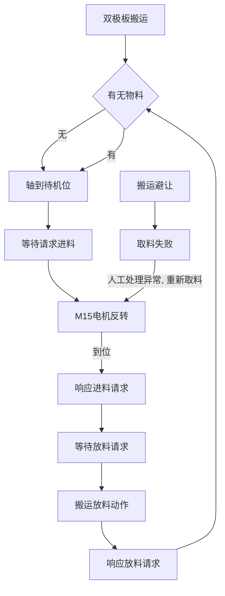

```mermaid
graph TD
0[双极板搬运]-->10
10{有无物料}-->|无|20
10-->|有|20
20[轴到待机位]-->30
30[等待请求进料]-->40
40[M15电机反转]-->|到位|50
50[响应进料请求]-->60
60[等待放料请求]-->70
70[搬运放料动作]-->80
80[响应放料请求]-->10

90[搬运避让]-->900

900[取料失败]-->|人工处理异常, 重新取料|40
```