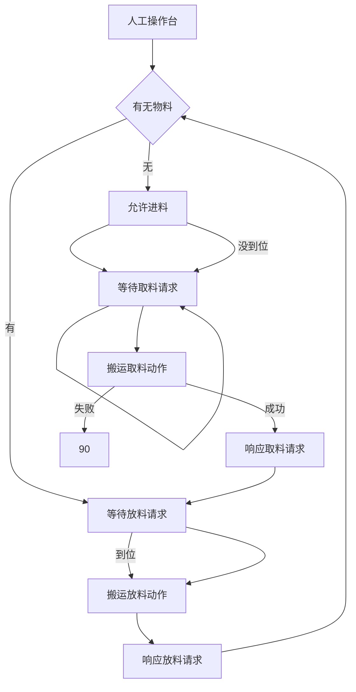

```mermaid
graph TD
0[人工操作台]-->10
10{有无物料}-->|无|20
10-->|有|60
20[允许进料]-->30
30[shan]-->30
60{是否到位}-->|到位|70
20-->|没到位|30
30[等待取料请求]-->40
40[搬运取料动作]-->|成功|50
40-->|失败|90
50[响应取料请求]-->60
60[等待放料请求]-->70
70[搬运放料动作]-->80
80[响应放料请求]-->10
```