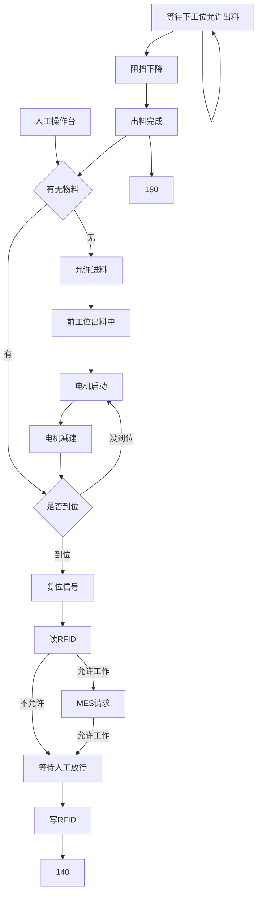

```mermaid
graph TD
0[人工操作台]-->10
10{有无物料}-->|无|20
10-->|有|60
20[允许进料]-->30
30[前工位出料中]-->40
40[电机启动]-->50
50[电机减速]-->60
60{是否到位}-->|到位|70
60-->|没到位|40
70[复位信号]-->80
80[读RFID]-->|允许工作|90
80-->|不允许|120
90[MES请求]-->|允许工作|120

120[等待人工放行]-->130
130[写RFID]-->140
150[MES上传]-->150
150[等待下工位允许出料]-->160
160[阻挡下降]-->170
170[电机启动]-->180
170[出料完成]-->10
```