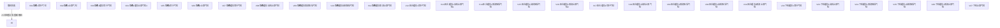

```mermaid
graph TD
V01:堆叠1顶升气缸
V02:堆叠1止回气缸
V03:堆叠1缓存顶升气缸
V04:堆叠1缓存止回气缸4
V05:堆叠2顶升气缸
V06:堆叠2止回气缸
V07:堆叠缓存顶升气缸
V08:堆叠缓存出料止回气缸
V09:堆叠缓存回流阻挡气缸
V10:堆叠缓存出料阻挡气缸
V11:堆叠缓存回流止回气缸
V12:压合缓存1顶升气缸
V13:压合缓存1出料止回气缸1
V14:压合缓存1回流阻挡气缸
V15:压合缓存1出料阻挡气缸
V16:压合缓存1回流止回气缸2
V17:压合缓存2顶升气缸
V18:压合缓存2出料止回气缸
V19:压合缓存2回流阻挡气缸
V20:压合缓存2出料阻挡气缸
V21:压合缓存2回流止回气缸
V22:下料缓存1顶升气缸
V23:下料缓存1出料止回气缸
V24:下料缓存1回流阻挡气缸
V25:下料缓存1出料阻挡气缸
V26:下料缓存1回流止回气缸
V27:下料止回气缸

900[取料失败]-->|人工处理异常, 重新取料|40
```