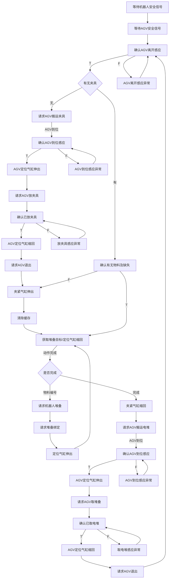

```mermaid
graph TD
10[等待机器人安全信号]-->20
    20[等待AGV安全信号]-->30
    30[确认AGV离开感应]-->|T|40
    30-->|F|900
    40{有无夹具}-->|无|50
    40-->|有|903
    50[请求AGV搬运夹具]-->|AGV到位|60
    60[确认AGV到位感应]-->|T|70
    60-->|F|901
    70[AGV定位气缸伸出]-->80
    80[请求AGV放夹具]-->90
    90[确认已放夹具]-->|T|100
    90-->|F|902
    100[AGV定位气缸缩回]-->110
    110[请求AGV退出]-->120
    120[夹紧气缸伸出]-->130
    130[清除缓存]-->140
    140[获取堆叠目标/定位气缸缩回]
    140-->|动作完成|145
    145{是否完成}-->|物料编号|150
    145-->|完成|170
    150[请求机器人堆叠]-->155
    155[请求堆叠绑定]-->160
    160[定位气缸伸出]-->140
    170[夹紧气缸缩回]-->180
    180[请求AGV搬运电堆]-->|AGV到位|190
    190[确认AGV到位感应]-->|T|200
    190-->|F|906
    200[AGV定位气缸伸出]-->210
    210[请求AGV取堆叠]-->220
    220[确认已取电堆]-->|T|230
    220-->|F|905
    230[AGV定位气缸缩回]-->240
    240[请求AGV退出]-->30


    900[AGV离开感应异常]-->30
    901[AGV到位感应异常]-->60
    902[放夹具感应异常]-->90
    903[确认有无物料及缺失]-->|T|140
    903-->|F|120
    905[取电堆感应异常]-->220
    906[AGV到位感应异常]-->190
  
```